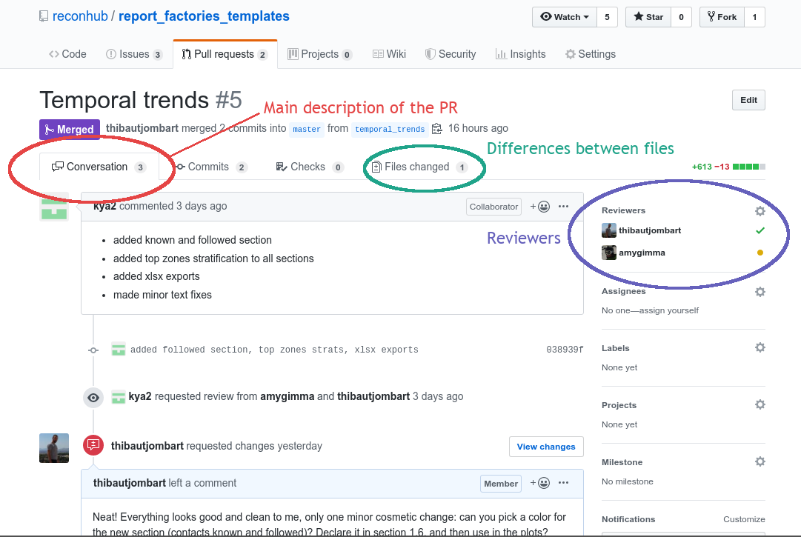
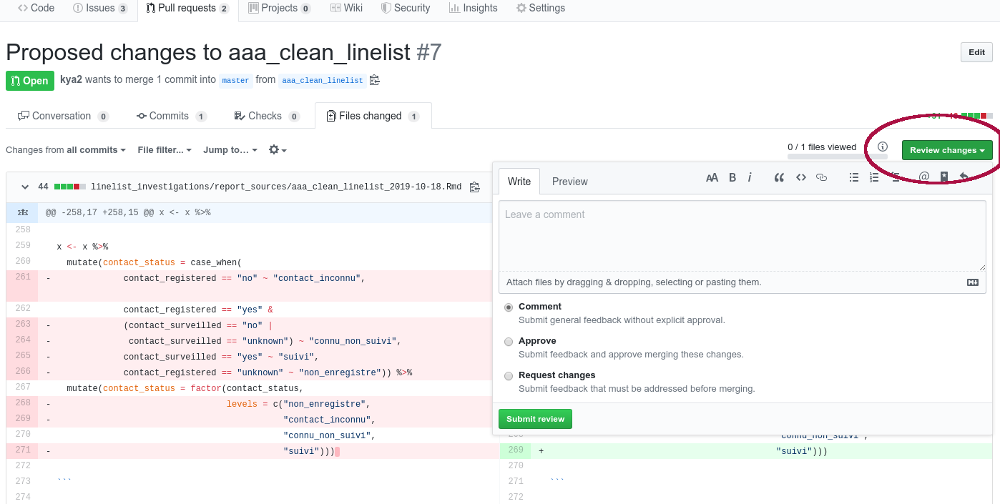

.img {
  width: 400px;
  height: 200px;
  border:2px solid #fff;
  background: url(img/tiger.png) no-repeat;
  -moz-box-shadow: 10px 10px 5px #ccc;
  -webkit-box-shadow: 10px 10px 5px #ccc;
  box-shadow: 10px 10px 5px #ccc;
  -moz-border-radius:25px;
  -webkit-border-radius:25px;
  border-radius:25px;
}


<!-- ========================================== -->
<!-- ========================================== -->
<!-- ========================================== -->
# Welcome to the *reportfactory* templates repository

This repository provides a collection of self-contained *report factories*, to
be used with the [*reportfactory*
package](https://github.com/reconhub/reportfactory).

Each of the sections below presents the available factories.

Make sure you use the latest version of the *reportfactoy* by typing:


```r
remotes::install_github("reconhub/reportfactory")
```


<br>

<!-- ========================================== -->
## *compare_data*: compare dataset updates

### Outline

This factory is designed for comparing 2 versions of a given datasets. It does
the following:

* check for differences in data structures (names, order and types of the variables)

* look for duplicates in each dataset

* compares duplicates in both datasets

* looks for changes between entries of the two datasets


### How to use it?

Clone or [download](https://github.com/reconhub/report_factories_templates/archive/master.zip) the factory, make sure the **reportfactory** is installed, then:

1. put your datasets in `data/data_comparison`

2. open **R** in the root factory folder or simply double-click on the
   `open.Rproj` file
   
3. (first time only) install dependencies by typing:


```r
reportfactory::install_deps()
```

4. run the factory by typing:


```r
reportfactory::update_reports(clean_report_sources = TRUE)
```

If you have several types of data in the `data/data_comparison` folder, you can
indicate which type of data to compare using:


```r
reportfactory::update_reports(clean_report_sources = TRUE, params(type = "xxx"))
```

where `xxx` is a character string uniquely present in the type of data to use.


<br>

<!-- ========================================== -->
## *linelist_investigations*: analyses from the Ebola North Kivu analytics cell

### Outline

This factory contains several reports providing analyses based on the Master
Line List (MLL), used routinely by the analytics cell of the Ebola response
based in the Emergency Operation Center, North Kivu, DRC. 

Note that as data are confidential, these are not shared here. Reports are meant
to work with the MLL data structure, and will need some adaptations for other
linelist data.

Reports include:

* `aaa_clean_linelist`: data cleaning for the master linelist; will create a
  clean dataset in `rds` and `xlsx` format, and generate a
  `current_clean_data.R` script in `scripts/` which sets the path to the newly
  cleaned data
  
* `active_health_areas`: analysis of geographic spread over time, represented by
  the number of active health areas (i.e. having reported cases over the last 21
  days)

* `age_sex`: age-sex pyramids, stratified by geographic units and in time

* `temporal_trends`: trends of various proportions in time, with some
  geographical stratifications, including
    + proportions of community death
    + proportions of cases known as contacts

* `epicurves`: epicurves with various stratifications, by case characteristics
  and by geographic units

* `kpi`: key performance indicators, used for general summaries of the state of
  the response


<br>

<!-- ========================================== -->
<!-- ========================================== -->
<!-- ========================================== -->
# Contributing

Contributions are welcome via pull requests against the *master* branch of the
project. Pushing directly to *master* has been disabled. Please follow the
guidelines below for contributions.


<!-- ========================================== -->
## Types of contributions

Types of contributions include:

1. submitting **new reports**

2. **amending** existing reports

3. **reviewing** reports sent through pull requests

Fundamentally, 1 and 2 are treated the same way and will undergo the same
workflow. Task 3 (reviewing) is slightly different, and described in a separate
section.

**All contributors, including reviewers, should be duely acknowledged on the
document they contributed to.**


<!-- ========================================== -->
## Submitting new reports or changes

First, **make sure you have read the guidelines** for writing analysis reports,
which you can download from <a
href="https://github.com/reconhub/guides/raw/master/golden_rules.html.zip"
download="golden_rules.html.zip" target="_blank">here</a>. To discuss or amend
these guidelines, see the corresponding [project on
github](https://github.com/reconhub/guides).


We use the usual github workflow for contributions:

1. **fork the project**, if you are not yet part of the development team; **otherwise,
   create a new branch** named after the issue you address, or (in the absence of
   corresponding issue) with a name pointing to the report you work on; for
   instance:


```bash
## if work relates to an existing issue 'xxx':
git checkout -b issue_xxx

## otherwise, e.g. if work relates to the temporal_trends report:
git checkout -b temporal_trends 	
```

2. **make the modifications** to the report, **test them** locally to make sure
   everything works and looks fine; **commit regularly** to avoid loosing work, e.g.


```bash
git commit -a -m "some short description of changes"
```
   
3. once happy with the new version, submit a [**pull
   request**](https://github.com/reconhub/report_factories_templates/compare)
   against the *master* branch; ideally, nominate a **reviewer** to speed up the
   reviewing process
   
4. reviews may require some changes; once the new version is satisfactory, PR
   will be merged into *master* and become the **new official version** of the
   report; this will need to be copied to the *pcloud* infrastructure, and used
   until a new version is made using the process described here.


<!-- ========================================== -->
## Revewing changes

As for writing reports, you need to be familiar with **the guidelines for writing analysis reports**,
which you can download from <a
href="https://github.com/reconhub/guides/raw/master/golden_rules.html.zip"
download="golden_rules.html.zip" target="_blank">here</a>. To discuss or amend
these guidelines, see the corresponding [project on
github](https://github.com/reconhub/guides).


Reviews form the cornerstone of a robust workflow, and constitute essential
contributions to the analysis work. Therefore, they are duely acknowledged onto
the reports themselves. In this section, we briefly outline the steps of a
review, and provide some guidelines on how to perform reviews.


### Workflow

Changes to reports (including the creation of new reports) are submitted via
[Pull Requests (PR)](pulls) by the authors. A PR basically proposes to merge
change made on a separate, dedicated branch onto the reference branch
*master*. As a reviewer, your task is to give your opinion on whether these
changes should integrate the *master* branch, and make suggestions to improve
weak points. This will involve the following steps:

1. **open the PR on the github website**; you might have been suggested as a
   reviewer, in which case you receive an email notification with a link to open
   the PR; or you may just volonteer to perform a review to address an existing
   [issue](issues); the landing page should ressemble the image below:
   



<br>

2. **read the main description** of the PR provided by the author on the
   *conversation tab*
   
<br>

3. **put yourself down as a reviewer** in the reviewer tab, if you are not
   listed there already
   
<br>

4. **examine the differences between files** on the '*Files changed*' tab; red
   lines indicated deletions, and green lines additions; note that these changes
   reflect all the commits of the PR; this part is particularly useful to flag
   accidental deletions and get an idea of large sections added; this is also
   the place where you can **write your review** and **comment on sections of
   the code** - clicking on any given line will open a new comment box, which
   you can use to *start a review*; leave this page open until you finish the
   review (including testing, see below)
   
<br>

5. **test** the changes on your computer:

* get the new version on your computer using `git`:


```bash
## update all remote branches, including the one of the PR
git fetch

## create a local branch matching that of the PR, and move to it
git checkout xxx
   
```

where `xxx` should be the name of the branch of the PR.

* make sure the data needed for the report are present at the right place in
your `data` folder; for `aaa_clean_data`, this will be a raw `xlsx` master
linelist file in `data/raw`; for other reports, this will be the cleaned `rds`
data in `data/clean/`, accompanied by a script in `scripts/current_clean_data.R`
pointing to the right file (generated automatically when `aaa_clean_data` is
compiled

* compile the report by opening the `open.Rproj` file in the root of the
factory, and typing:
	

```r
reportfactory::compile_report("report_name_date.Rmd", clean_report_sources = TRUE)
```

where `"report_name_date.Rmd"` is the name and date of the report changed.

* if the compilation is successful, check the output produced in
  `report_outputs/report_name_date/...`; go back to the review page on github
  and complete your review according to your observations
	


<br> 6. **Final decision**: when your review is finished, conclude it by clicking on
  '**Review changes**' as illustrated below; possible decisions are:




* **approve**: all is good, or all changes requested in previous stages of the
      review have been made; this will enable merging the PR into the *master*
      branch

* **request changes**: some changes are needed, either to fix issues, improve
      code or explanations, fine-tune graphics, etc.; it is not uncommon to
      request changes several times before approving a final version
	  
* **comments**: most reviews will either lead to approval or to requesting
  changes; only use this if neither applies (maybe for questions /
  conversational items)


